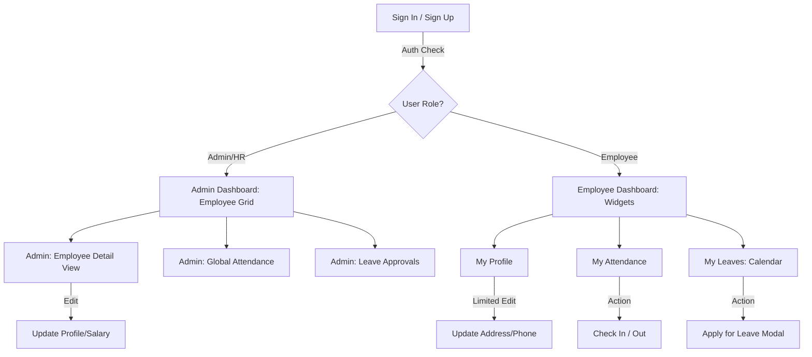

# WorkFrame

**Every workday, perfectly aligned.**

  

## Application Flow & Screen Navigation

This document outlines the user journey and screen-to-screen navigation for **WorkFrame** based on the architectural wireframes.

  

---

  

### 1. Global Authentication Flow

All users enter the system through the centralized authentication module.

  

* **Screen 1.1: Sign In**

    * **Inputs:** Email, Password.

    * **Actions:** `Login` -> Authenticates and checks User Role.

    * **Routing:** * If `Role == Admin`: Redirect to **Admin Dashboard (2.1)**

        * If `Role == Employee`: Redirect to **Employee Dashboard (3.1)**

* **Screen 1.2: Sign Up**

    * **Inputs:** Employee ID, Email, Password, Role Dropdown (Employee/HR).

    * **Actions:** `Register` -> Validates inputs, creates user, redirects to Sign In.

  

---

  

### 2. Admin / HR Flow

Administrators have a top-down view of the organization, starting from an employee directory.

  

* **Screen 2.1: Admin Dashboard (Employee Directory)**

    * **UI Elements:** Grid view of all registered employees (Cards with Profile Picture, Name, Role).

    * **Actions:** * `Click on Employee Card` -> Navigates to **Admin Employee Detail View (2.2)**

        * `Maps to Attendance` -> Navigates to **Global Attendance (2.3)**

        * `Maps to Approvals` -> Navigates to **Leave Approvals Queue (2.4)**

  

* **Screen 2.2: Admin Employee Detail View**

    * **UI Elements:** Detailed view of a specific employee's data.

    * **Sub-sections:**

        * **Profile:** Full edit access to Personal Details, Job Details, Salary Structure.

        * **Attendance History:** Read-only view of the employee's logs.

        * **Leave History:** Past and pending requests for this specific employee.

  

* **Screen 2.3: Global Attendance**

    * **UI Elements:** Master table showing daily/weekly attendance status (Present, Absent, Leave, Half-day) for all staff.

  

* **Screen 2.4: Leave Approvals Queue**

    * **UI Elements:** List of pending leave requests.

    * **Actions:** `Approve`, `Reject`, `Add Comment`. (Updates employee status).

  

---

  

### 3. Employee Flow

Employees have a personalized, bottom-up view focused on their own data and daily actions.

  

* **Screen 3.1: Employee Dashboard**

    * **UI Elements:** Quick-access widgets/cards.

    * **Actions:**

        * `Click Profile` -> Navigates to **My Profile (3.2)**

        * `Click Attendance` -> Navigates to **My Attendance (3.3)**

        * `Click Leave Requests` -> Navigates to **My Leaves (3.4)**

        * `Click Logout` -> Ends session, routes to **Sign In (1.1)**

  

* **Screen 3.2: My Profile**

    * **UI Elements:** Read-only view of Job Details and Salary/Payroll.

    * **Actions:** `Edit` -> Allows updating limited fields (Phone, Address, Profile Picture).

  

* **Screen 3.3: My Attendance**

    * **UI Elements:** * Daily Check-in / Check-out toggle button.

        * Historical table view of personal attendance records.

  

* **Screen 3.4: My Leaves (Calendar & Requests)**

    * **UI Elements:** Monthly calendar visualization showing days marked as Present, Absent, or on Leave.

    * **Actions:** * `Apply for Leave` -> Opens **Leave Request Modal (3.4.1)**

  

* **Screen 3.4.1: Leave Request Modal**

    * **Inputs:** * Leave Type Dropdown (Paid, Sick, Unpaid).

        * Date Range Picker.

        * Remarks/Reason text area.

    * **Actions:** `Submit` -> Sets status to Pending, notifies Admin.

  

---

  

### 4. Visual State Diagram

  

